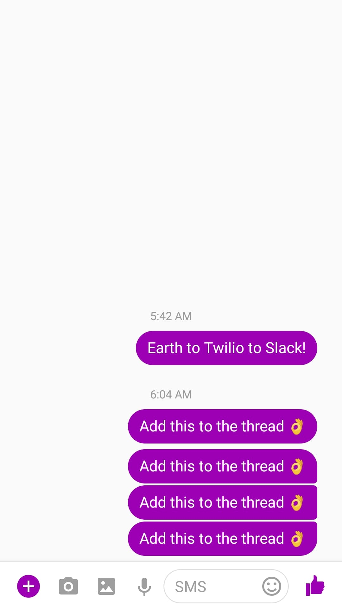

# Slack-Twilio-Bot

This bot posts messages sent to designated Twilio number and posts them to your desired Slack channel.

# Built with
- Node.js
- Twilio
- Slack
- Firebase

# Demo

# Run with
`npm install`
`Node index.js`
